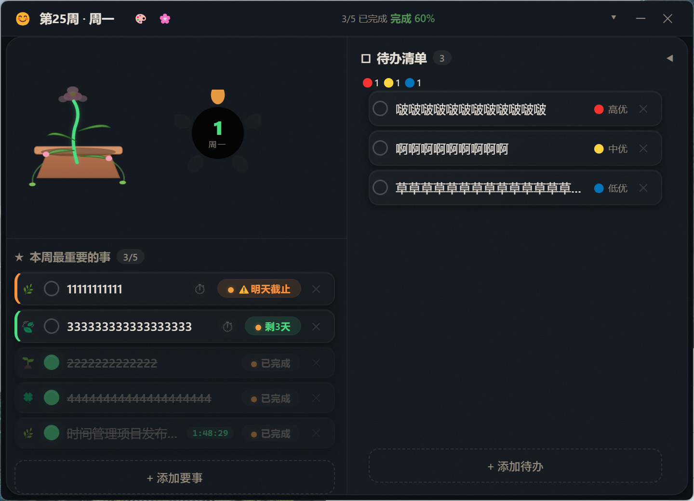
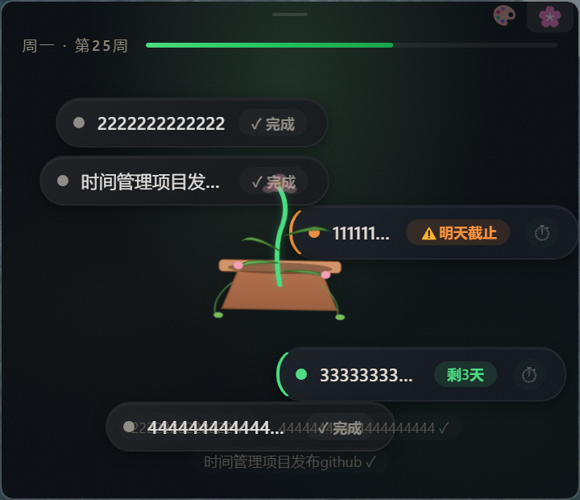
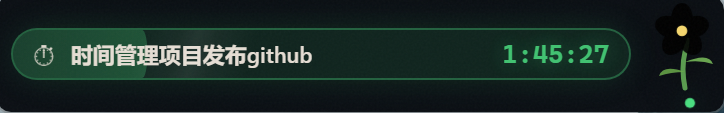
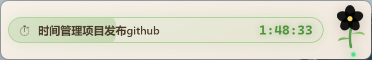
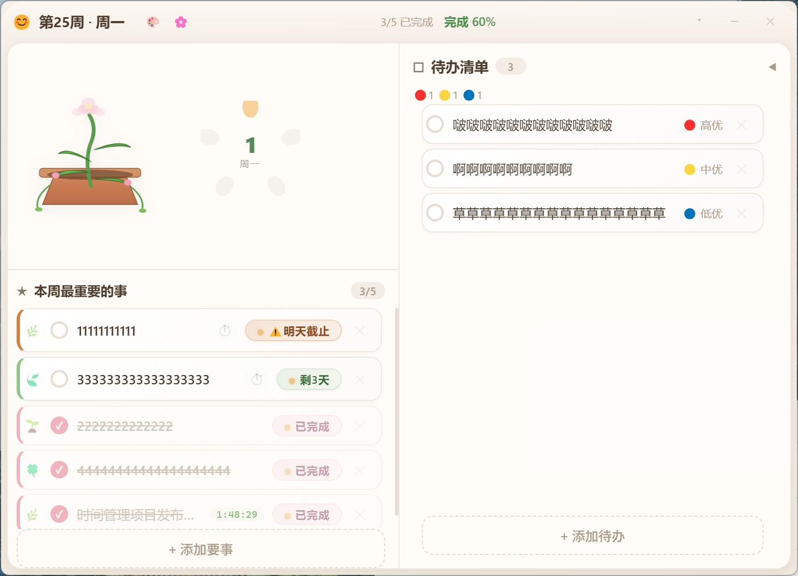
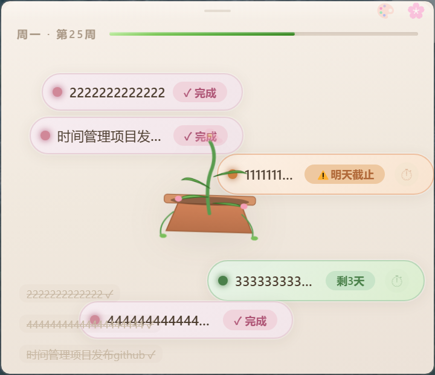

# 🌸 TimeGarden —— 桌面周计划盆栽

> 一盆会生长的桌面植物，你的每周进度看得见。

[English](README.md) | 中文

<p align="center">
  
  
  <br/><sub>暗色主题 — Full 面板 &amp; Mini 花盆</sub>
</p>

<p align="center">
  
  
  
  <br/><sub>Nano 悬浮花 · 专注模式（暗色）· 专注模式（亮色）</sub>
</p>

---

## ✨ 这是什么

TimeGarden 把你每周最重要的事变成一株桌面植物。完成任务 → 叶子开花。逾期太久 → 叶子枯萎。内置专注计时器、三种视图模式、暗色/亮色双主题。

## 🪴 三种视图

| 视图 | 尺寸 | 说明 |
|------|------|------|
| **Nano 悬浮花** | 48×68 | 吸附桌面边缘的一朵小花，悬停看进度，专注时变计时条 |
| **Mini 花盆** | 360×310 ↕ | 默认视图，陶瓷花盆 + 可自由拖动排列的气泡任务卡片 |
| **Full 面板** | 720×520 ↕ | 完整操作面板，要事/待办双栏，植物 + 花瓣进度环 |

## ⚡ 核心功能

- 🌱 **植物隐喻** — 4片叶子对应4项要事，按时完成→开花，逾期→枯萎
- ⏱ **专注计时** — 点任务卡片 ⏱ 进入专注，Nano 悬浮条显示任务名 + 实时计时 + 25分钟循环进度条
- 🌓 **双主题** — 暗色 Dark Glass（翡翠绿强调）/ 亮色 Warm Ceramic（日式陶器风）
- 📅 **智能紧迫度** — 基于截止日自动计算，渐变色卡片 + 紧迫度标签
- 🎨 **丰富动效** — 粒子特效、开花动画、呼吸光晕、专注流光、循环进度条
- 🔒 **数据本地** — 所有数据仅存本机，无需账号、无云端、无追踪

<p align="center">
  
  
  <br/><sub>亮色主题 — 日式陶器温暖极简</sub>
</p>

## 🚀 快速开始

```bash
git clone https://github.com/wl1650918245/timegarden.git
cd timegarden
npm install
npm start
```

## 🔧 技术栈

| 层 | 技术 |
|---|------|
| 桌面框架 | Electron 35 |
| 渲染层 | HTML + CSS + Vanilla JS |
| 图形 | 内联 SVG |
| 存储 | 本地 JSON |

## ⌨️ 快捷键

| 键 | 操作 |
|-----|------|
| `ESC` | Full → Mini |
| 单击花 | Nano → Mini |
| 双击花 | Nano → Full |
| 右键花 | 快捷菜单 |

## 🔐 隐私

所有数据只在你电脑上。无埋点、无统计、无账号、无网络请求。

## 📄 License

MIT
